# Attitudes Toward Wife Beating

Azka Nur Afifah

## Introduction

Menurut survey BKKBN tahun 2017[1], sebanyak hampir sepertiga perempuan dalam ikatan pernikahan percaya bahwa seorang suami berhak memukul istrinya setidaknya dalam satu dari lima keadaan tertentu. Laporan tersebut juga menyebutkan bahwa persentase tersebut sedikit menurun bila dibandingkan dengan tahun 2012. Penulis ingin melihat bagaimana hubungan tingkat pendidikan, tingkat ekonomi, daerah tinggal, serta pernikahan di bawah umur perempuan mempengaruhi sikap terhadap pemukulan istri dan apakah hubungan tersebut dapat digambarkan oleh sebuah model statistik.

## Dataset

Dataset yang digunakan berasal dari Demographic and Health Surveys (DHS) Program untuk Indonesia tahun 2017. Survey dilakukan terhadap perempuan umur 15-49 tahun dan didapatkan hasil survey lengkap untuk 49627 responden. Terdapat 5492 fitur dalam dataset asli dan bentuk yang sudah di-encode, sehingga untuk keperluan studi kasus ini perlu dipilih beberapa fitur dengan seksama mengikuti manual agar tiap kolom yang dipakai berasal dari populasi yang sama. Dari dataset ini, dipilih subset perempuan yang sudah pernah menikah.

### Umur

Sebagian besar responden wanita yang sudah menikah berasal dari kelompok usia 35-39 tahun. Sebagian kecil (1,98%) berada pada kelompok usia 15-19 tahun.

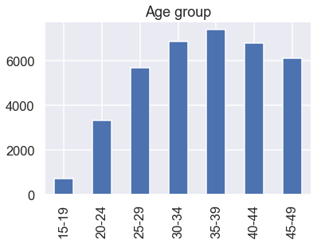

### Indeks Kesejahteraan

Skor faktor indeks kesejahteraan didasarkan pada beberapa aspek seperti kepemilikan aset yang dipilih, bahan bangunan tempat tinggal, sumber air minum, fasilitas toilet, jenis bahan bakar rumah tangga, dan lainnya. Distribusinya miring ke kiri.

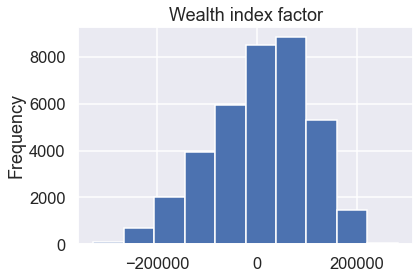

Perempuan dari rumah tangga yang masuk ke dalam quintil 1 (paling miskin) cenderung lebih menerima pembenaran pemukulan terhadap istri daripada perempuan dari rumah tangga yang lebih sejahtera.

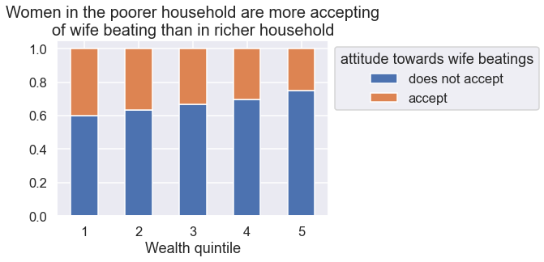

### Tempat Tinggal

Terdapat sedikit lebih banyak perempuan yang berasal dari daerah perkotaan di survey ini.

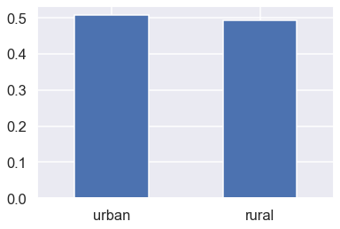

Perempuan yang tinggal di daerah pedesaan lebih menerima pembenaran pemukulan istri dibanding yang tinggal di kota.


### Capaian Akademis

Hanya 42% perempuan yang sudah menamatkan setidaknya tingkat SMA. 


Perempuan dengan pendidikan tinggi relatif tidak menerima pembenaran pemukulan terhadap istri sebagaimana perempuan dengan pendidikan lainnya.


### Pernikahan di Bawah Umur

Sebanyak 10.95% responden menikah di usia di bawah 16 tahun.

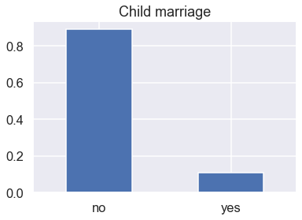

Perempuan yang menikah di bawah umur cenderung lebih menerima pembenaran pemukulan istri (37.73% vs 32.79%).

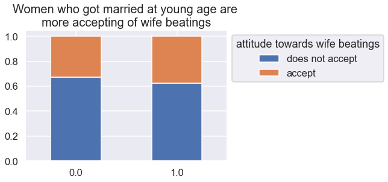

## Statistical Test

Faktor-faktor seperti indeks kesejahteraan, tempat tinggal, dan tingkat pendidikan menunjukkan tren yang agak lebih mudah dilihat jika dibandingkan dengan sikap penerimaan terhadap pemukulan, namun tidak demikian dengan faktor pernikahan di bawah umur.

Hipotesis Nol (H0): Proporsi perempuan yang menerima pembenaran pemukulan istri antara perempuan yang menikah di bawah umur adalah lebih kecil sama dengan perempuan yang menikah tidak di bawah umur

Hipotesis alternatif (H1): Proporsi perempuan yang menerima pembenaran pemukulan istri di antara perempuan yang menikah di bawah umur lebih besar dari yang tidak menikah di bawah umur.
alpha = 0.05

Dengan menggunakan two sample z-test untuk proporsi, didapatkan hasil sbb:
- z test statistic (5.452) > z critical (1.645) -> tolak H0
- p value (0.0) < alpha -> tolak H0

Kita bisa 95% yakin bahwa perempuan yang menikah di usia muda lebih cenderung membenarkan pemukulan terhadap istri dibandingkan dengan mereka yang tidak menikah sebesar 2,69% - 5,82%. Hal ini mungkin tidak terbukti signifikan secara praktis, jadi kita tidak akan menggunakan fitur ini.

## Feature Engineering

Data yang akan dipakai adalah perempuan generasi MZ (lahir 1990 ke atas) dengan umur 27 tahun ke bawah (pada tahun survey 2017 berumur maksimum 27 tahun) dengan tambahan fitur-fitur sbb.

1. `is_hs_grad` = perempuan dengan tingkat pencapaian pendidikan `4` dan `5` (minimal lulus SMA)
2. `is_rural` = `1` jika bertempat tinggal di pedesaan, `0` jika bertempat tinggal di perkotaan
3. `wealth_score` = `wealth_index / 100000` untuk memudahkan interpretasi koefisien
4. `poor_edu_sup` = menggambarkan kondisi buruknya dukungan pendidikan dari lingkungan seorang perempuan, didapat dari interaksi kebalikan `is_hs_grad` dan `child_marriage` (jika tidak lulus SMA dan menikah di bawah umur, maka `poor_edu_sup` = `1`)


## Building Regression Model

Buat fungsi yang me-return model yang sudah di-fitting dan koefisien standard error-nya.

```python
import statsmodels.formula.api as smf

def lr_model_fit(relationship:str):
    lr = smf.logit(relationship, df_data)
    lr_model = lr.fit()
    return print_coef_std_err(lr_model), lr_model
```

### Modelling: Benchmark model 1 predictor

**1 predictor: `wealth score`**

Menggunakan 1 prediktor yaitu `wealth_score`, didapat kurva hasil regresi sbb.

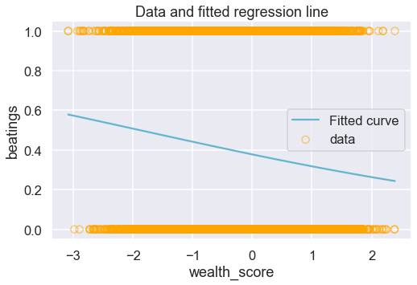

Interpretasi

|              |      coef |  std err | 
|-------------:|----------:|---------:|
|    Intercept | -0.498464 | 0.024995 |
| wealth_score | -0.265135 | 0.026077 |


```math
P(\text{beatings}) = \text{logit}^{-1}(-0.498 - 0.265\text{wealth\_score})
```

- Koefisien negatif menunjukkan bahwa perempuan dengan `wealth_score` yang lebih tinggi cenderung memiliki probabilitas yang lebih rendah untuk menerima pembenaran pemukulan
- Perubahan 1 unit `wealth_score` setara dengan 6.63% (0.265135/4) perbedaan negatif untuk probabilitas menerima pembenaran pemukulan
- Dengan mempertimbangkan bahwa penaikan 1 unit `wealth_score` menggambarkan peningkatan kelas ekonomi seseorang, perbedaan sikap sebesar 6.63% dalam probabilitas penerimaan pemukulan tidak menunjukkan perbedaan yang signifikan secara praktis. Bagi seseorang untuk pindah ke kelas ekonomi yang lebih tinggi terdapat banyak faktor yang terlibat yang tentunya bukanlah suatu hal yang mudah dilakukan atau diukur.

**1 interaction term: `poor_edu_sup`**

Menggunakan 1 prediktor berupa interaction term `poor_edu_sup`, didapat hasil regresi sbb. 


Interpretasi

|              |      coef |  std err |
|-------------:|----------:|---------:|
|    Intercept | -0.498464 | 0.024995 |
| wealth_score | -0.265135 | 0.026077 |


```math
P(\text{beatings}) = \text{logit}^{-1}(-0.5025 + 0.34155\text{poor\_edu\_sup})
```

- Koefisien positif menunjukkan bahwa nilai yang lebih tinggi dari `poor_edu_sup` (=memiliki dukungan pendidikan yang buruk) cenderung memiliki probabilitas yang lebih tinggi untuk penerimaan pembenaran pemukulan.
- Perempuan dengan dukungan pendidikan yang buruk (tidak tamat SMA dan menikah pada usia remaja) memiliki selisih 8.54% (0.34155/4) lebih tinggi dalam hal probabilitas menerima pembenaran pemukulan.
- Standar error yang dihasilkan lebih kecil dari koefisien `poor_edu_sup`

### Modelling: Benchmark model 2 predictors

**2 predictors: `wealth_score` & `is_rural`**

Menggunakan 2 prediktor, `wealth_score` dan `is_rural`, didapat hasil regresi sebagai berikut.

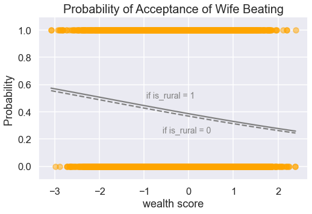

Gambar di atas menunjukkan bahwa perempuan yang tinggal di pedesaan memiliki probabilitas menerima pembenaran pemukulan dibanding perempuan yang tinggal di perkotaan. Untuk perempuan dengan `wealth_score` yang sama, lokasi tempat tinggal tidak mempengaruhi probabilitas menerima pembenaran pemukulan.

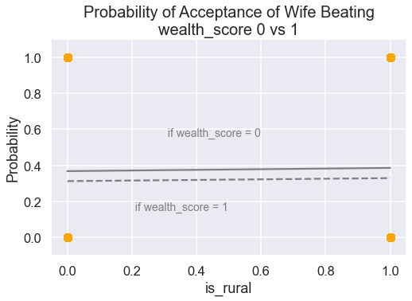

Perempuan dari rumah tangga dengan kelas ekonomi yang lebih rendah memiliki probabilitas yang lebih tinggi untuk menerima pembenaran pemukulan, namun tidak terlalu besar.

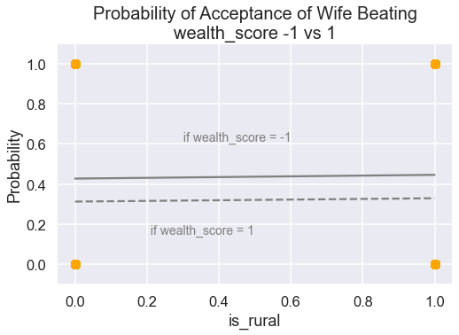

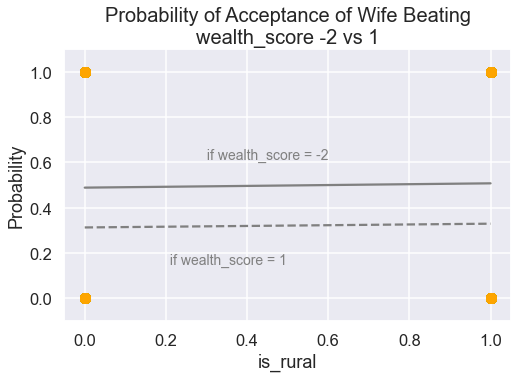

Dari kedua gambar di atas, perbedaan dalam probabilitas seorang perempuan menerima pembenaran pemukulan akan lebih terlihat ketika perempuan tersebut naik sebanyak 3 unit `wealth_score`, yang mana terdengar cukup mustahil.

Interpretasi

|              |      coef |  std err |
|-------------:|----------:|---------:|
|    Intercept | -0.498464 | 0.024995 |
| wealth_score | -0.265135 | 0.026077 |

```math
P(\text{beatings}) = \text{logit}^{-1}(-0.538 - 0.247\text{wealth\_score} + 0.076\text{is\_rural})
```

- Koefisien untuk `wealth_score` lebih besar dari standar errornya, sementara koefisien untuk is_rural hanya sedikit lebih besar dari standar errornya.
- Ketika seorang perempuan naik `wealth_score`, hal ini setara dengan 6.175% (0.247 / 4) lebih rendahnya probabilitas untuk menerima pembenaran pemukulan terhadap istri.
- Sementara itu, ketika seorang perempuan tinggal di daerah perkotaan (is_rural turun 1, is_rural = 0) hanya berhubungan dengan 1.9% (0.076 / 4) lebih rendahnya kemungkinan menerima pembenaran pemukulan.

**2 predictors: `wealth_score` & `poor_edu_sup`**

`poor_edu_sup` adalah suku interaksi antara `non_hs_grad` (kebalikan dari `is_hs_grad`) dan `child_marriage`.

![]fitted_curve_2pred2_1.png)

Di antara perempuan dari rumah tangga dengan `wealth_score` yang sama perempuan yang tidak meiliki support pendidikan yang baik cenderung memiliki probabilitas yang lebih tinggi untuk menerima pembenaran pemukulan terhadap istri.

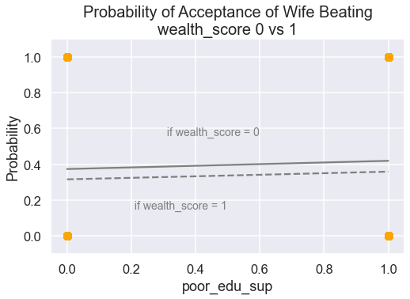


Di antara perempuan yang mendapat support pendidikan yang sama mereka yang berasal dari rumah tangga dengan `wealth_score` yang tinggi memiliki probabilitas yang lebih rendah untuk menerima pembenaran pemukulan.

Interpretasi 

|              |      coef |  std err |
|-------------:|----------:|---------:|
|    Intercept | -0.498464 | 0.024995 |
| wealth_score | -0.265135 | 0.026077 |

```math
P(\text{beatings}) = \text{logit}^{-1}(-0.538 - 0.2545\text{wealth\_score} + 0.192\text{poor\_edu\_sup})
```

- Koefisien untuk `walth_score` lebih besar daripada standar errornya, sementara koefisien untuk `poor_edu_sup` hanya sedikit lebih besar daripada standar errornya.
- Ketika seorang perempuan naik 1 `wealth_score`, hal ini berhubungan dengan 6.365% (0.2545 / 4) probabilitas yang lebih rendah untuk menerima pembenaran pemukulan.
- Sementara itu, ketika seorang perempuan memiliki dukungan pendidikan yang lebih baik selama masa remajanya, hal ini hanya berhubungan dengan 4.8% (0.192 / 4) lebih rendahnya kemungkinan menerima pembenaran pemukulan.

## Evaluation

Hitung log score untuk beberapa model berikut.
1. model null (lempar koin, p = 0.5)
2. model baseline (p = persen perempuan yang menerima pembenaran pemukulan di sampel data)
3. model logistic regression 1 prediktor (`wealth_score`)
4. model logistic regression 1 prediktor (interaction term `poor_edu_sup`)
5. model logistic regression 2 prediktor (`wealth_score` dan `is_rural`)
6. model logistic regression 2 prediktor (`wealth_score` dan `poor_edu_sup`)

|                |    log_score |
|---------------:|-------------:|
|     null_model | -4847.871381 |
| baseline_model | -4662.607017 |
| logreg_1pred_1 | -4607.080532 |
| logreg_1pred_2 | -4651.248979 |
| logreg_2pred_1 | -4606.156506 |
| logreg_2pred_2 | -4604.580172 |

Berdasarkan perhitungan log score, model logistic regression yang telah dilakukan hanya dapat memperbaiki predictive log score sebanyak 58 dari model baseline.

## Conclusion

Upaya yang telah dilakukan untuk memodelkan sikap perempuan generasi MZ terhadap pembenaran pemukulan terhadap istri dengan menggunakan regresi logistik berdasarkan nilai kekayaan rumah tangga, tingkat pendidikan, tempat tinggal, dan status pernikahan di bawah umur hanyalah merupakan bentuk penyederhanaan. Seperti yang telah kita lihat dari hasil model, peningkatan skor kekayaan rumah tangga perempuan tampaknya menurunkan probabilitas pembenaran pemukulan terhadap istri, tetapi hanya jika mereka naik ke tingkat ekonomi yang jauh lebih tinggi. Meskipun demikian, latihan ini membuka mata kita bahwa perempuan muda Indonesia tidak kebal terhadap normalisasi kekerasan terhadap perempuan.

Data survei DHS memiliki fitur yang luas tentang koresponden dan rumah tangga mereka yang mungkin lebih berguna untuk memprediksi sikap perempuan terhadap pemukulan terhadap istri selain yang sudah dieksplorasi dalam laporan ini. 

Pembaca yang tertarik mungkin dapat membaca makalah terkait dari The SMERU Research Institute tentang penentu perkawinan anak pada perempuan muda di Indonesia.

## Reference

[1] National Population and Family Planning Board (BKKBN), Statistics Indonesia (BPS), Ministry of Health (Kemenkes), and ICF.  018. Indonesia Demographic and Health Survey 2017. Jakarta, Indonesia: BKKBN, BPS, Kemenkes, and ICF.
